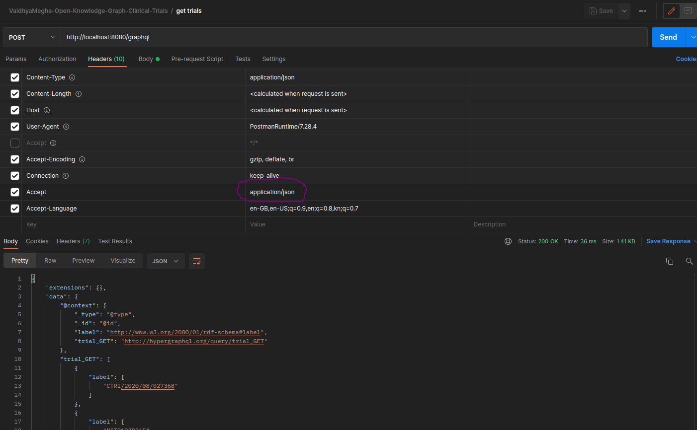

# Introduction

This repo will host open knowledge graphs from [VaidhyaMegha](https://vaidhyamegha.com).

# Open Knowledge Graph on Clinical Trials

VaidhyaMegha has built an open [knowledge graph](https://arxiv.org/pdf/2003.02320.pdf) on clinical trials. This repository contains the source code along with instructions to generate and use the knowledge graph.

## Getting Started

- Pre-requisite steps
  - Create a folder  'lib'. Download algs4.jar file from [here](https://algs4.cs.princeton.edu/code/algs4.jar) and place in 'lib' folder.
  - Download hypergraphql jar file from [here](https://www.hypergraphql.org/resources/hypergraphql-3.0.1-exe.jar) and place in 'lib' folder.
  - Dowload 'vocabulary_1.0.0.ttl' file from [here](https://nlmpubs.nlm.nih.gov/projects/mesh/rdf/2022/vocabulary_1.0.0.ttl) and place in 'data/open_knowledge_graph_on_clinical_trials'  folder.
  - Download mesh2022.nt.gz from [here](https://nlmpubs.nlm.nih.gov/projects/mesh/rdf/2022/mesh2022.nt.gz) and unzip it. Place mesh2022.nt file 'data/open_knowledge_graph_on_clinical_trials'  folder.
  - Download PheGenI from [here](https://www.ncbi.nlm.nih.gov/projects/gap/eqtl/EpiViewBE.cgi?type=dl.tab) and place PheGenI_Association_full.tab file 'data/open_knowledge_graph_on_clinical_trials'  folder.
  - Download detailed_CoOccurs_2021.txt.gz from [here](https://data.lhncbc.nlm.nih.gov/public/ii/information/MRCOC/detailed_CoOccurs_2021.txt.gz) and unzip it. Place detailed_CoOccurs_2021.txt file in 'data/open_knowledge_graph_on_clinical_trials' folder.
  	- Generate detailed_CoOccurs_2021_selected_fields.txt and detailed_CoOccurs_2021_selected_fields_sorted.txt files using following commands. Place both detailed_CoOccurs_2021_selected_fields.txt and detailed_CoOccurs_2021_selected_fields_sorted.txt files in 'data/open_knowledge_graph_on_clinical_trials' folder.
  	```
	cut -d '|' -f1,9,15 data/open_knowledge_graph_on_clinical_trials/detailed_CoOccurs_2021.txt > data/open_knowledge_graph_on_clinical_trials/detailed_CoOccurs_2021_selected_fields.txt
	```
	``` 
	sort -u  data/open_knowledge_graph_on_clinical_trials/detailed_CoOccurs_2021_selected_fields.txt > data/open_knowledge_graph_on_clinical_trials/detailed_CoOccurs_2021_selected_fields_sorted.txt
	```

- To compile and package
  ```
  mvn clean package assembly:single -DskipTests
  ```
- To build RDF
  ```
  java -jar -Xms4096M -Xmx8192M target/vaidhyamegha-knowledge-graphs-v0.9-jar-with-dependencies.jar
  ```
- To query using SparQL
  ```
  java -jar -Xms4096M -Xmx8144M target/vaidhyamegha-knowledge-graphs-v0.9-jar-with-dependencies.jar -m cli -q src/main/sparql/1_count_of_records.rq
  ...
  Results:
  -------- 
  5523173^^http://www.w3.org/2001/XMLSchema#integer
  ```
- To query using GraphQL (via [HyperGraphQL](https://www.hypergraphql.org/documentation/))
  ```
  java -cp "target/vaidhyamegha-knowledge-graphs-v0.9-jar-with-dependencies.jar:lib/*" com.vaidhyamegha.data_cloud.kg.App -m server
  ```
  - From Postman with ntriples response

  - From Postman with json response

  - In a separate terminal execute GraphQL query using curl (alternatively use Postman)
    ```
    $ curl --location --request POST 'http://localhost:8080/graphql' --header 'Accept: application/ntriples' --header 'Accept-Language: en-GB,en-US;q=0.9,en;q=0.8,kn;q=0.7' --header 'Content-Type: application/json' --data-raw '{"query":"{\n  trial_GET(limit: 30, offset: 1) {\n    label\n  }\n \n}","variables":{}}'
    <https://www.who.int/clinical-trials-registry-platform/EUCTR2007-006072-11-SE> <http://www.w3.org/1999/02/22-rdf-syntax-ns#type> <https://vaidhyamegha.com/open_kg/ct> .
    <https://www.who.int/clinical-trials-registry-platform/EUCTR2007-006072-11-SE> <http://www.w3.org/2000/01/rdf-schema#label> "EUCTR2007-006072-11-SE"^^<http://www.w3.org/2001/XMLSchema#string> .
    <https://clinicaltrials.gov/ct2/show/NCT02954757> <http://www.w3.org/1999/02/22-rdf-syntax-ns#type> <https://vaidhyamegha.com/open_kg/ct> .
    <https://clinicaltrials.gov/ct2/show/NCT02954757> <http://www.w3.org/2000/01/rdf-schema#label> "NCT02954757"^^<http://www.w3.org/2001/XMLSchema#string> .
    <https://www.who.int/clinical-trials-registry-platform/EUCTR2014-005525-13-FI> <http://www.w3.org/1999/02/22-rdf-syntax-ns#type> <https://vaidhyamegha.com/open_kg/ct> .
    <https://www.who.int/clinical-trials-registry-platform/EUCTR2014-005525-13-FI> <http://www.w3.org/2000/01/rdf-schema#label> "EUCTR2014-005525-13-FI"^^<http://www.w3.org/2001/XMLSchema#string> .
    <https://clinicaltrials.gov/ct2/show/NCT02721914> <http://www.w3.org/1999/02/22-rdf-syntax-ns#type> <https://vaidhyamegha.com/open_kg/ct> .
    <https://clinicaltrials.gov/ct2/show/NCT02721914> <http://www.w3.org/2000/01/rdf-schema#label> "NCT02721914"^^<http://www.w3.org/2001/XMLSchema#string> .
    ...
    <http://hypergraphql.org/query> <http://hypergraphql.org/query/trial_GET> <https://www.who.int/clinical-trials-registry-platform/EUCTR2016-002461-66-IT> .
    <http://hypergraphql.org/query> <http://hypergraphql.org/query/trial_GET> <https://www.who.int/clinical-trials-registry-platform/CTRI/2020/08/027368> .
    <http://hypergraphql.org/query> <http://hypergraphql.org/query/trial_GET> <https://www.who.int/clinical-trials-registry-platform/EUCTR2013-001294-24-DE> .
    ```
  
## Features as on current release - 0.9

**Summary** : Using any trial id from across the globe find the associated diseases/interventions,  research articles and genes. Also discover relationships b/w various medical topics through co-occurrences in articles. Query the graph using SparQL from cli or GraphQL using any API client  tool ex: Postman or curl  

**Feature list** :

- Using GraphQL API knowledge graph can be queried using any API client tool ex: curl or Postman.
- Graph includes trials from across the globe. Data is sourced from WHO's ICTRP and clinicaltrials.gov
- Links from trial to MeSH vocabulary are added for conditions and interventions employed in the trial.
- Links from trial to PubMed articles are added. PubMed's experts curate this metadata information for each article.
- Added MRCOC to the graph for the selected articles linked to clinical trials.
- Added PheGenI links i.e. links from phenotype to genotype as links between MeSH DUI and GeneID.
- Added SparQL query execution feature. Adding CLI mode. Adding a count SparQL query for demo.
- 5 co-existing bi-partite graphs b/w trial--> condition, trial--> intervention, trial --> articles, article --> MeSH DUIs, gene id --> MeSH DUIs together comprise this knowledge graph.

**Changes in this release** : Server mode of execution is added.


## Release notes 

- v0.9
  - Enable server mode of execution using [HyperGraphQL](https://www.hypergraphql.org/)
  ```
    java -cp "target/vaidhyamegha-knowledge-graphs-v0.9-jar-with-dependencies.jar:lib/*" com.vaidhyamegha.data_cloud.kg.App -m server
  ```
- v0.8
  - Enable GraphQL interface to the knowledge graph using [HyperGraphQL](https://www.hypergraphql.org/)
  ```
  java -Dorg.slf4j.simpleLogger.defaultLogLevel=debug -jar lib/hypergraphql-3.0.1-exe.jar --config src/main/resources/hql-config.json
  ```
- v0.7
  - Enable SparQL queries
  ```
	$ cat src/main/sparql/1_count_of_records.rq 
	SELECT (count(*) as ?count)
	where { ?s ?p ?o}

	$ sparql --data=data/open_knowledge_graph_on_clinical_trials/vaidhyamegha_open_kg_clinical_trials.nt --query=src/main/sparql/1_count_of_records.rq
	-----------
	| count   |
	===========
	| 4766048 |
	-----------

	$ wc -l data/open_knowledge_graph_on_clinical_trials/vaidhyamegha_open_kg_clinical_trials.nt 
	4766048 data/open_knowledge_graph_on_clinical_trials/vaidhyamegha_open_kg_clinical_trials.nt
  ```
- v0.6.1
  - Externalize the Entrez API invocation threshold probability
  - Patch for below issue
  ```
    $ sparql --data=data/open_knowledge_graph_on_clinical_trials/vaidhyamegha_open_kg_clinical_trials.nt --query=src/main/sparql/example.rq
    04:33:04 ERROR riot            :: [line: 1085476, col: 71] Bad character in IRI (Tab character): <https://www.who.int/clinical-trials-registry-platform/SLCTR/2020/014[tab]...>
    Failed to load data

    $ grep "SLCTR/2020/014" data/open_knowledge_graph_on_clinical_trials/vaidhyamegha_open_kg_clinical_trials.nt 
    <https://www.who.int/clinical-trials-registry-platform/SLCTR/2020/014	> <TrialId> "SLCTR/2020/014\t" .

  ```
- v0.6
  - Added PheGenI links i.e. links from phenotype to genotype as links between MeSH DUI and GeneID.
  ```
  <https://www.ncbi.nlm.nih.gov/gene/10014> <Gene> <http://id.nlm.nih.gov/mesh/2022/T046007> .
  <https://www.ncbi.nlm.nih.gov/gene/10014> <GeneID> "10014" .
  <https://www.ncbi.nlm.nih.gov/gene/6923> <Gene> <http://id.nlm.nih.gov/mesh/2022/T032324> .
  <https://www.ncbi.nlm.nih.gov/gene/6923> <GeneID> "6923" .
  <https://www.ncbi.nlm.nih.gov/gene/3198> <Gene> <http://id.nlm.nih.gov/mesh/2022/T032324> .
  <https://www.ncbi.nlm.nih.gov/gene/3198> <GeneID> "3198" .
  ```
- v0.5
  - Adding MRCOC to the graph for the selected articles linked to clinical trials.
  ```
  <https://pubmed.ncbi.nlm.nih.gov/20926522> <MeSH_DUI> <https://meshb.nlm.nih.gov/record/ui?ui=D064451> .
  <https://pubmed.ncbi.nlm.nih.gov/17404119> <MeSH_DUI> <https://meshb.nlm.nih.gov/record/ui?ui=D008297> .
  <https://pubmed.ncbi.nlm.nih.gov/17404119> <MeSH_DUI> <https://meshb.nlm.nih.gov/record/ui?ui=D006801> .
  ```
- v0.4
  - List of trial ids to be incrementally bounced against Entrez API to generate the necessary incremental mappings b/w trials and PubMed articles
  ```
  $ grep "Pubmed_Article" data/open_knowledge_graph_on_clinical_trials/vaidhyamegha_open_kg_clinical_trials.nt 
  <https://clinicaltrials.gov/ct2/show/NCT00400075> <Pubmed_Article> "25153486" .
  <https://clinicaltrials.gov/ct2/show/NCT03934957> <Pubmed_Article> "34064657" .
  ```
- v0.3
  - Adding links between trials and interventions in addition to trials and conditions.
  - conditions and interventions are fetched from database (instead of files). Corresponding edges b/w trials and conditions, trials and interventions are added to RDF. For example :
  ```
    <https://clinicaltrials.gov/ct2/show/NCT00093782> <Condition> <http://id.nlm.nih.gov/mesh/2022/T000687> .
    <https://clinicaltrials.gov/ct2/show/NCT00093782> <Intervention> <http://id.nlm.nih.gov/mesh/2022/T538652> .
  ```
  - All global trial's - 756,169 - are added to RDF. For example :
  ```
  <https://clinicaltrials.gov/ct2/show/NCT00172328> <TrialId> "NCT00172328" .
  <https://www.who.int/clinical-trials-registry-platform/CTRI/2021/05/033487> <TrialId> "CTRI/2021/05/033487" .
  ```
  - Starting with a fresh model for final RDF. MeSH ids that are not linked to any trial not considered. This reduces the graph size considerably.
  - Trial records are fetched from ICTRP's weekly + periodic full export and AACT's daily + monthly full snapshot. 
  - Trials are written down to a file (will be used later) : [vaidhyamegha_clinical_trials.csv](data/open_knowledge_graph_on_clinical_trials/vaidhyamegha_clinical_trials.csv)
  ```
    $ wc -l vaidhyamegha_clinical_trials.csv
    755272 vaidhyamegha_clinical_trials.csv
  ```
  - Download the RDF from [here](https://github.com/VaidhyaMegha/vaidhyamegha-knowledge-graphs/releases/tag/v0.3).
- v0.2
  - Clinical trials are linked to the RDF nodes corresponding to the MeSH terms for conditions. For example : 
  - Download the enhanced RDF from [here](https://github.com/VaidhyaMegha/vaidhyamegha-knowledge-graphs/releases/tag/v0.2).

## Documentation

More information, including references, is available in [article](docs/open_knowledge_graph_on_clinical_trials/out.pdf) and also [here](docs/open_knowledge_graph_on_clinical_trials/README.md) 

## Prequels to this project

VaidhyaMegha's [prior work](https://github.com/VaidhyaMegha/vaidhyamegha-knowledge-graphs/tree/main/examples) on

- clinical trial registries data [linking](https://ct.biosdlc.com/).
- symptoms to diseases linking.
- phenotype to genotype linking.
- trials to research articles linking.

Last 3 are covered in the ["examples"](examples) folder [here](https://github.com/VaidhyaMegha/vaidhyamegha-knowledge-graphs). They were covered in separate public repos [here](https://github.com/VaidhyaMegha/) earlier.

## Next steps 

- Complete article
- Full list of trial ids to be used in combination with id_information table to generate a final list of unique trials using WQUPC algorithm
- Add secondary trial ids to graph (this may increase graph size considerably). However, it could be of utility.
- Build SparQL + GraphQL version of API to allow direct querying of the graph. Provide some reasonable examples that are harder in SQL.
- Snowmed CT, ICD 10.
- Host Knowledge graph on Ne04j's cloud service, [Aura DB](https://neo4j.com/cloud/aura).
- Use Neo4j's [GraphQL](https://neo4j.com/developer/graphql/) API from Postman to demonstrate sample queries on clinical trials.

