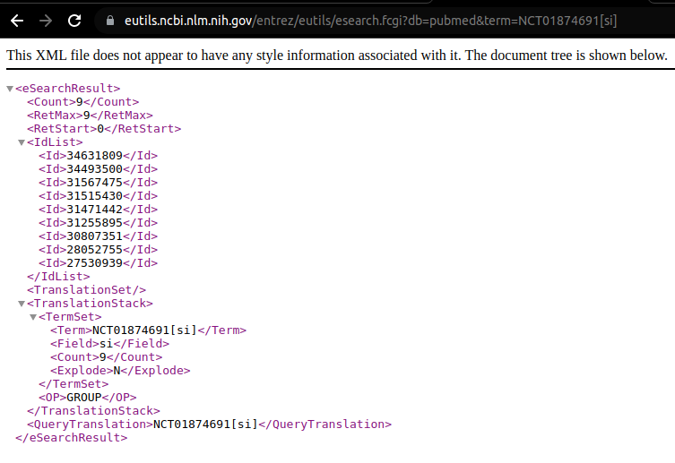

---
title: Open knowledge graph on clinical trials
author:
  - Sandeep Kunkunuru:
      institute:
        - iiphh
        - vaidhyamegha
      email: hi18sk@iiphh.org
      orcid: 0000-0002-8886-1846
      correspondence: "yes"
institute:
  - iiphh:
      name: IIPH Hyderabad
      address: Plot # 1, Rd Number 44, Masthan Nagar, Kavuri Hills, Jubilee Hills, Madhapur, Telangana 500033
      phone: +91 040 4900 6000
  - vaidhyamegha:
      name: VaidhyaMegha Private Limited
      address: Plot No. 112/A, H. No. 3-5-139/3/3/2,Shivanagar Colony Attapur,Hyderguda, Hyderabad,Telangana 500048.
      phone: +91 9618986039
      email: 'contact@vaidhyamegha.com'
bibliography: bibliography.bib
csl: acm.csl
link-citations: true
project:
  title: Open knowledge graph on clinical trials 
  zip-url: https://github.com/VaidhyaMegha/vaidhyamegha-knowledge-graphs/releases
  github-url: https://github.com/VaidhyaMegha/vaidhyamegha-knowledge-graphs/
...

# Abstract

Using any clinical trial id from across the globe find the associated diseases, interventions, research articles and genes. Also discover relationships between various medical topics through co-occurrences in articles. Query the graph using SparQL from cli or GraphQL using any API client  tool ex: Postman or curl

# Introduction

## Sources

- WHO's ICTRP
  - Registries covered in ICTRP include : 
- AACT Clinicaltrials.gov
- NLM MeSH
- NLM MRCOC
- NLM PubMed
- NLM PheGenI

# Methods

## Trial to condition
## Trial to intervention
#  Clinical trials to research articles

- The NLM (The world's largest medical library, the U.S. National Library of Medicine is part of the National Institutes of Health) extracts  trail ids from an article and places them into the article's metadata in secondary id field.
- To retrieve journal articles related to a clinical trial id ex: NCT00000419, use PubMed’s API called e-Utils with clinical trial id as shown below:

```
https://eutils.ncbi.nlm.nih.gov/entrez/eutils/esearch.fcgi?db=pubmed&term=NCT01874691[si]
```

- In the above URL "\[si\]" refers to Secondary ID which can be used to search within article's metadata.
- All the journal articles related to the clinical trial id will be returned
- Output contains PMIDs (pubmed records) of respective clinical trials.
 
- Using Spring WebClient, JAXB, Jackson and Lambok response XML is automatically parsed and PMID list is constructed in-memory. 
- The PMID list is then written into RDF along with trial id using Apache Jena.

## Article  to MeSH DUIs
## Gene id  to MeSH DUIs

# Results
## Feature list

- Using GraphQL API knowledge graph can be queried using any API client tool ex: curl or Postman.
- Graph includes trials from across the globe. Data is sourced from WHO's ICTRP and clinicaltrials.gov
- Links from trial to MeSH vocabulary are added for conditions and interventions employed in the trial.
- Links from trial to PubMed articles are added. PubMed's experts curate this metadata information for each article.
- Added MRCOC to the graph for the selected articles linked to clinical trials.
- Added PheGenI links i.e. links from phenotype to genotype as links between MeSH DUI and GeneID.
- Added SparQL query execution feature. Adding CLI mode. Adding a count SparQL query for demo.
- 5 co-existing bi-partite graphs together comprise this knowledge graph. Bi-partite graphs are between
  - trial--> condition
  - trial--> intervention
  - trial --> articles
  - article --> MeSH DUIs
  - gene id --> MeSH DUIs


## Demonstration

### Querying knowledge graph using SparQL
```
$ java -jar -Xms4096M -Xmx8144M \
    target/vaidhyamegha-knowledge-graphs-1.0-SNAPSHOT-jar-with-dependencies.jar \
    -m cli -q src/main/sparql/1_count_of_records.rq
...
Results:
-------- 
4766048^^http://www.w3.org/2001/XMLSchema#integer
```

### Querying knowledge graph using GraphQL (via HyperGraphQL)

#### Start server
```
java -Dorg.slf4j.simpleLogger.defaultLogLevel=debug -jar lib/hypergraphql-3.0.1-exe.jar \
        --config src/main/resources/hql-config.json
```
#### Start client

In a separate terminal execute GraphQL query using curl (alternatively use Postman)

```
$ curl --location --request POST 'http://localhost:8080/graphql' \
    --header 'Accept: application/ntriples' \ 
    --header 'Accept-Language: en-GB,en-US;q=0.9,en;q=0.8,kn;q=0.7' \
    --header 'Content-Type: application/json' \
    --data-raw \
    '{"query": "{\n trial_GET(limit: 30, offset: 1) {\n label\n }\n \n}","variables":{}}'

<https://www.who.int/clinical-trials-registry-platform/EUCTR2007-006072-11-SE> 
    <http://www.w3.org/1999/02/22-rdf-syntax-ns#type> 
    <https://vaidhyamegha.com/open_kg/ct> .
<https://www.who.int/clinical-trials-registry-platform/EUCTR2007-006072-11-SE> 
    <http://www.w3.org/2000/01/rdf-schema#label> 
    "EUCTR2007-006072-11-SE"^^<http://www.w3.org/2001/XMLSchema#string> .
<https://clinicaltrials.gov/ct2/show/NCT02954757> 
    <http://www.w3.org/1999/02/22-rdf-syntax-ns#type> 
    <https://vaidhyamegha.com/open_kg/ct> .
<https://clinicaltrials.gov/ct2/show/NCT02954757> 
    <http://www.w3.org/2000/01/rdf-schema#label> 
    "NCT02954757"^^<http://www.w3.org/2001/XMLSchema#string> .
<https://www.who.int/clinical-trials-registry-platform/EUCTR2014-005525-13-FI> 
    <http://www.w3.org/1999/02/22-rdf-syntax-ns#type> 
    <https://vaidhyamegha.com/open_kg/ct> .
<https://www.who.int/clinical-trials-registry-platform/EUCTR2014-005525-13-FI> 
    <http://www.w3.org/2000/01/rdf-schema#label> 
    "EUCTR2014-005525-13-FI"^^<http://www.w3.org/2001/XMLSchema#string> .
<https://clinicaltrials.gov/ct2/show/NCT02721914> 
    <http://www.w3.org/1999/02/22-rdf-syntax-ns#type> 
    <https://vaidhyamegha.com/open_kg/ct> .
<https://clinicaltrials.gov/ct2/show/NCT02721914> 
    <http://www.w3.org/2000/01/rdf-schema#label> 
    "NCT02721914"^^<http://www.w3.org/2001/XMLSchema#string> .
...
<http://hypergraphql.org/query> <http://hypergraphql.org/query/trial_GET> 
    <https://www.who.int/clinical-trials-registry-platform/EUCTR2016-002461-66-IT> .
<http://hypergraphql.org/query> <http://hypergraphql.org/query/trial_GET> 
    <https://www.who.int/clinical-trials-registry-platform/CTRI/2020/08/027368> .
<http://hypergraphql.org/query> <http://hypergraphql.org/query/trial_GET> 
    <https://www.who.int/clinical-trials-registry-platform/EUCTR2013-001294-24-DE> .
```

# Discussions

## Further reading

For more information please read

@10.1145/1013367.1013381.
@10.1145/1629501.1629525.

# Acknowledgements

# Declarations

## Appendix

# Tables 

# Figures
- 

# References