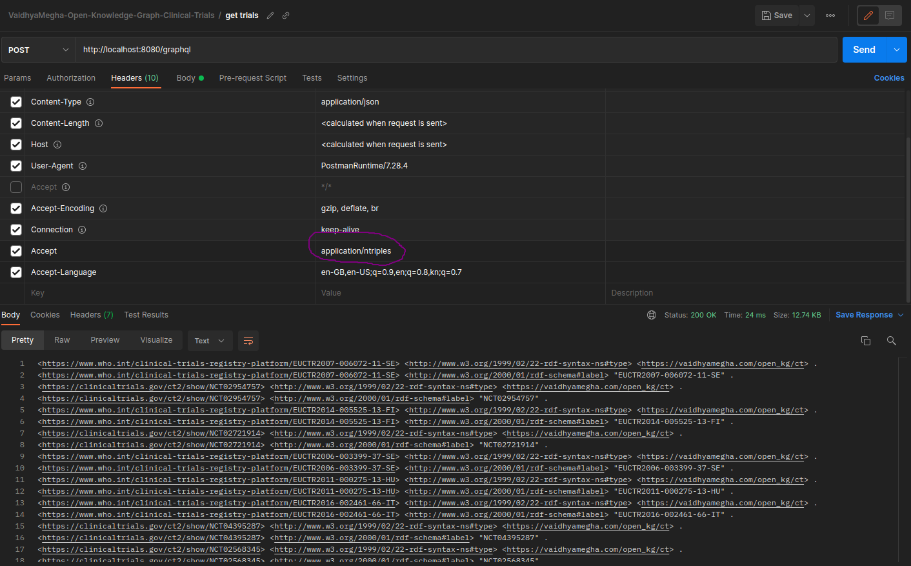
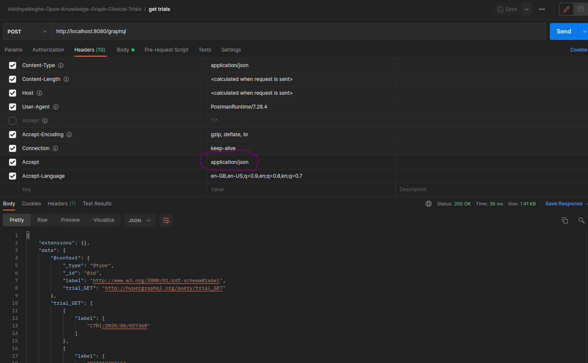

---
title: Open knowledge graph on clinical trials
author:
  - Sandeep Kunkunuru:
      institute:
        - iiphh
        - vaidhyamegha
      email: hi18sk@iiphh.org
      orcid: 0000-0002-8886-1846
      correspondence: "yes"
institute:
  - iiphh:
      name: IIPH Hyderabad
      address: Plot # 1, Rd Number 44, Masthan Nagar, Kavuri Hills, Jubilee Hills, Madhapur, Telangana 500033
      phone: +91 040 4900 6000
  - vaidhyamegha:
      name: VaidhyaMegha Private Limited
      address: Plot No. 112/A, H. No. 3-5-139/3/3/2, Shivanagar Colony Attapur, Hyderguda, Hyderabad,Telangana 500048.
      phone: +91 9618986039
      email: 'contact@vaidhyamegha.com'
bibliography: bibliography.bib
csl: acm.csl
link-citations: true
project:
  title: Open knowledge graph on clinical trials 
  zip-url: https://github.com/VaidhyaMegha/vaidhyamegha-knowledge-graphs/releases
  github-url: https://github.com/VaidhyaMegha/vaidhyamegha-knowledge-graphs/
...

# Abstract

Knowledge graphs, semantic web and related topics have garnered considerable interest recently. Knowledge graphs are considered generally as a natural/intuitive form of knowledge representation and also as a queryable repository of knowledge. Several knowledge graphs have been built in several domains including medicine and its subdomains. On clinical trials, the research engine, of innovation in medicine, very few attempts have been made. This paper presents methods and techniques to build a knowledge graph for clinical trials. Such that,using any clinical trial id, from across the globe, we can find the associated diseases, interventions, research articles and genes. This paper demonstrates way to query this graph using SparQL from command-line or GraphQL using any API client tool ex: Postman or curl. Also, we can discover relationships between various medical topics through co-occurrences in articles.

# Introduction

A knowledge graph could be defined as below per @hogan2021knowledge 

```
...
Herein we adopt an inclusive definition, where we view a knowledge graph as a graph 
of data intended to accumulate and convey knowledge of the real world, whose nodes 
represent entities of interest and whose edges represent relations between these 
entities. The graph of data (aka data graph) conforms to a graph-based data model, 
which may be a directed edge-labelled graph, a propertygraph, etc
... 
By knowledge, we refer to something that is known. Such knowledge may be accumulated 
from external sources, or extracted from the knowledge graph itself.
```

The objective of this project was to build a knowledge graph with clinical trial ids at the heart and below feature list in addition :

## Feature list

- Using GraphQL API knowledge graph can be queried using any API client tool ex: curl or Postman.
- Graph includes trials from across the globe. Data is sourced from WHO's ICTRP and [clinicaltrials.gov](https://clinicaltrials.gov)
- Links from trial to MeSH vocabulary are added for conditions and interventions employed in the trial.
- Links from trial to PubMed articles are added. PubMed's experts curate this metadata information for each article.
- Added MRCOC to the graph for the selected articles linked to clinical trials.
- Added PheGenI links i.e. links from phenotype to genotype as links between MeSH DUI and GeneID.
- Added SparQL query execution feature. Adding CLI mode. Adding a count SparQL query for demo.
- 5 co-existing bi-partite graphs together comprise this knowledge graph. Bi-partite graphs are between
    - trial--> condition
    - trial--> intervention
    - trial --> articles
    - article --> MeSH DUIs
    - gene id --> MeSH DUIs

## Sources

- WHO's [ICTRP](https://www.who.int/clinical-trials-registry-platform/the-ictrp-search-portal). Registries covered in ICTRP include : 
  - Australian New Zealand Clinical Trials Registry (ANZCTR)
  - Brazilian Clinical Trials Registry (ReBec)
  - Chinese Clinical Trial Registry (ChiCTR)
  - Clinical Research Information Service (CRiS), Republic of Korea
  - Clinical Trials Registry - India (CTRI)
  - Cuban Public Registry of Clinical Trials(RPCEC)
  - EU Clinical Trials Register (EU-CTR)
  - German Clinical Trials Register (DRKS)
  - Iranian Registry of Clinical Trials (IRCT)
  - ISRCTN
  - Japan Registry of Clinical Trials (jRCT)
  - Lebanese Clinical Trials Registry (LBCTR)
  - Thai Clinical Trials Registry (TCTR)
  - The Netherlands National Trial Register (NTR)
  - Pan African Clinical Trial Registry (PACTR)
  - Peruvian Clinical Trial Registry (REPEC)
  - Sri Lanka Clinical Trials Registry (SLCTR)
- AACT @10.1371/journal.pone.0033677 database for [clinicaltrials.gov](https://clincialtrials.gov)
- NLM [MeSH](https://www.ncbi.nlm.nih.gov/pmc/articles/PMC35238/#) @lipscomb2000medical
- NLM [MRCOC](https://lhncbc.nlm.nih.gov/ii/information/MRCOC.html)
- NLM PubMed
- NLM [PheGenI](https://www.ncbi.nlm.nih.gov/pmc/articles/PMC3865418/) @ramos2014phenotype

# Methods

This section lists of high level steps that were executed to build each of the 5 bi-partite graphs.

## Linking clinical trials to conditions

- AACT @10.1371/journal.pone.0033677 offers [clinicaltrials.gov](https://clincialtrials.gov)'s clinical trial registration data as a downloadable database snapshot. 
- This snapshot includes all the trial registration data along with MeSH literals for conditions.
- Database snapshot is in the form a PostgreSQL database dump.
- Snapshot was restored into a PostgreSQL database and the table 'browse_conditions' was queried to retrieve MeSH literals for conditions.
- MeSH literals were then queried within MeSH RDF to retrieve MeSH DUIs.
- Trial id and MeSH DUIs were used to create an edge in the knowledge graph using Apache Jena @10.1145/1013367.1013381 @10.1145/1629501.1629525

## Linking clinical trials to interventions

- The same AACT snapshot as above includes all the trial registration data along with MeSH literals for interventions too.
- Snapshot was restored into a PostgreSQL database and the table 'browse_interventions' was queried to retrieve MeSH literals for conditions.
- MeSH literals were then queried within MeSH RDF to retrieve MeSH DUIs.
- Trial id and MeSH DUIs were used to create an edge in the knowledge graph using Apache Jena @10.1145/1013367.1013381 @10.1145/1629501.1629525

## Collecting trials from across the globe

- While several approaches exist to keep the design simple, ICTRP's full export dataset along with its weekly incremental files were used.
- These files were imported into a PostgreSQL database as a table.
- After de-duplicating trial ids across AACT's database a global unique list of trial ids, across the globe, is formulated.
- This final list of trials is exported as an intermediate artifact in a CSV file format.

## Linking clinical trials to research articles

- The final list of trials exported above as CSV file is read one-line at a time.
- The NLM (The world's largest medical library, the U.S. National Library of Medicine is part of the National Institutes of Health) extracts  trail ids from an article and places them into the article's metadata in secondary id field.
- To retrieve journal articles related to a clinical trial id ex: NCT00000419, use PubMed’s API called e-Utils with clinical trial id as shown below:

```
https://eutils.ncbi.nlm.nih.gov/entrez/eutils/esearch.fcgi?db=pubmed&term=NCT01874691[si]
```

- In the above URL "\[si\]" refers to Secondary ID which can be used to search within article's metadata.
- All the journal articles related to the trial id are collected from the above API invocation.
- Output contains PMIDs (pubmed records) of respective clinical trials.

  

- Using Spring WebClient, JAXB, Jackson and Lambok response XML is automatically parsed and PMID list is constructed in-memory. 
- The PMID list is then written into RDF along with trial id using Apache Jena.
- The PMIDs are also persisted into database along with trial id, irrespective of whether any linked articles are found or not.


## Linking articles to MeSH DUIs

- NLM provides a MeSH term co-occurrence file which provides co-occurrences of MeSH terms (DUIs) at the article level in a pipe separated file format.
- This file is currently at 183 GB size with approximately 1.7 Billion rows.
- The necessary 3 columns need for the purposes of linking articles to MeSH DUI were selected from the file using linux commands. Columns include article id, MeSH DUI 1 and MeSH DUI 2
- The resultant filtered list is sorted on article id column, to allow for efficient search operations. 
- This filtered and sorted MRCOC file currently is of 40 GB size with same row count i.e. 1.7 Billion rows
- List of trials along with articles, persisted above in database is used to a build a sorted list of article ids.
- This list of article ids is read one id at a time, i.e. it is read in a streaming fashion.
- Filtered and sorted MRCOC file is also read in a streaming fashion in a file [co-parsing pattern](https://www.linkedin.com/pulse/why-algorithmic-thinking-needed-vaidhyamegha).
- Matches are found between articles and MRCOC file records while linearly parsing both.
- All matches are saved into knowledge graph as edges using Apache Jena @10.1145/1013367.1013381 @10.1145/1629501.1629525

## Linking genes to MeSH DUIs

- NLM provides PheGenI, a search tool and database for linking Phenotype MeSH literals to Gene IDs.
- Phenotype/trait along with Gene Id 1 and Gene ID 2 are selected from the PheGeni file.
- If trait is already present in the knowledge graph i.e. if the trait is found to be linked to any trial, then below edges are added using Apache Jena @10.1145/1013367.1013381 @10.1145/1629501.1629525
  - trait --> Gene Id 1
  - trait --> Gene Id 2

# Results


## Querying knowledge graph using SparQL
```
java -jar -Xms4096M -Xmx8144M target/vaidhyamegha-knowledge-graphs-v0.9-jar-with-dependencies.jar \
    -m cli -q src/main/sparql/1_count_of_records.rq
...
Results:
-------- 
5523173^^http://www.w3.org/2001/XMLSchema#integer
```

## Querying knowledge graph using GraphQL

Design for possibly bridges between GraphQL and RDF @taelman2019bridges datasets have been explored and implemented extensively since [GraphQL](https://graphql.org/) @byron2015graphql was originally published as an alternative API form.

### Start server
```
  java -cp "target/vaidhyamegha-knowledge-graphs-v0.9-jar-with-dependencies.jar:lib/*" \ 
    com.vaidhyamegha.data_cloud.kg.App -m server

```
### From Postman

- With ntriples response



- With json response



### Start client

In a separate terminal execute GraphQL query using curl (alternatively use Postman)

```
$ curl --location --request POST 'http://localhost:8080/graphql' \
    --header 'Accept: application/ntriples' \ 
    --header 'Accept-Language: en-GB,en-US;q=0.9,en;q=0.8,kn;q=0.7' \
    --header 'Content-Type: application/json' \
    --data-raw \
    '{"query": "{\n trial_GET(limit: 30, offset: 1) {\n label\n }\n \n}","variables":{}}'

<https://www.who.int/clinical-trials-registry-platform/EUCTR2007-006072-11-SE> 
    <http://www.w3.org/1999/02/22-rdf-syntax-ns#type> 
    <https://vaidhyamegha.com/open_kg/ct> .
<https://www.who.int/clinical-trials-registry-platform/EUCTR2007-006072-11-SE> 
    <http://www.w3.org/2000/01/rdf-schema#label> 
    "EUCTR2007-006072-11-SE"^^<http://www.w3.org/2001/XMLSchema#string> .
<https://clinicaltrials.gov/ct2/show/NCT02954757> 
    <http://www.w3.org/1999/02/22-rdf-syntax-ns#type> 
    <https://vaidhyamegha.com/open_kg/ct> .
<https://clinicaltrials.gov/ct2/show/NCT02954757> 
    <http://www.w3.org/2000/01/rdf-schema#label> 
    "NCT02954757"^^<http://www.w3.org/2001/XMLSchema#string> .
<https://www.who.int/clinical-trials-registry-platform/EUCTR2014-005525-13-FI> 
    <http://www.w3.org/1999/02/22-rdf-syntax-ns#type> 
    <https://vaidhyamegha.com/open_kg/ct> .
<https://www.who.int/clinical-trials-registry-platform/EUCTR2014-005525-13-FI> 
    <http://www.w3.org/2000/01/rdf-schema#label> 
    "EUCTR2014-005525-13-FI"^^<http://www.w3.org/2001/XMLSchema#string> .
<https://clinicaltrials.gov/ct2/show/NCT02721914> 
    <http://www.w3.org/1999/02/22-rdf-syntax-ns#type> 
    <https://vaidhyamegha.com/open_kg/ct> .
<https://clinicaltrials.gov/ct2/show/NCT02721914> 
    <http://www.w3.org/2000/01/rdf-schema#label> 
    "NCT02721914"^^<http://www.w3.org/2001/XMLSchema#string> .
...
<http://hypergraphql.org/query> <http://hypergraphql.org/query/trial_GET> 
    <https://www.who.int/clinical-trials-registry-platform/EUCTR2016-002461-66-IT> .
<http://hypergraphql.org/query> <http://hypergraphql.org/query/trial_GET> 
    <https://www.who.int/clinical-trials-registry-platform/CTRI/2020/08/027368> .
<http://hypergraphql.org/query> <http://hypergraphql.org/query/trial_GET> 
    <https://www.who.int/clinical-trials-registry-platform/EUCTR2013-001294-24-DE> .
```

# Discussions

# Acknowledgements

# Declarations

# Tables

# References